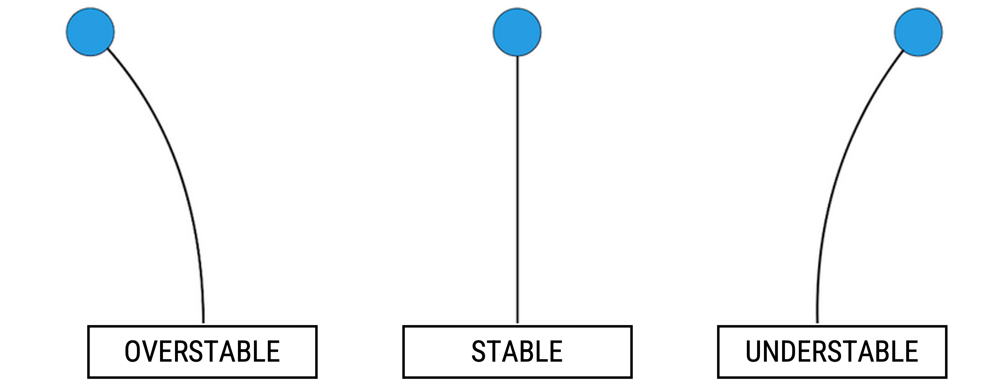
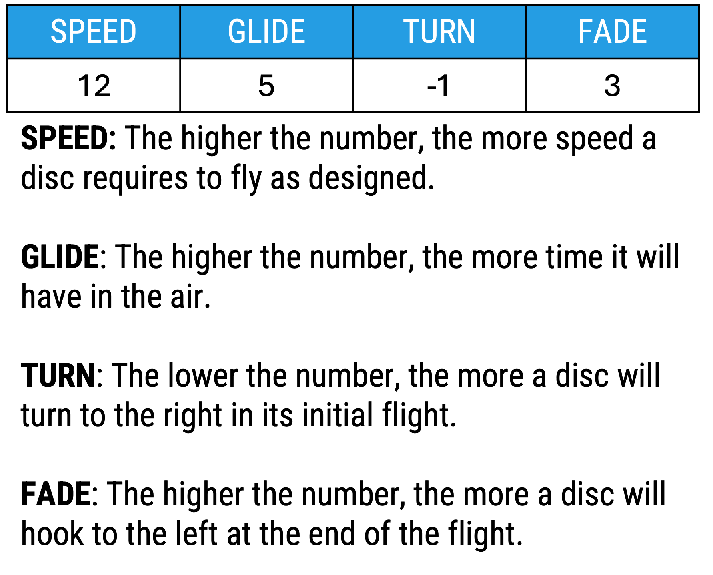
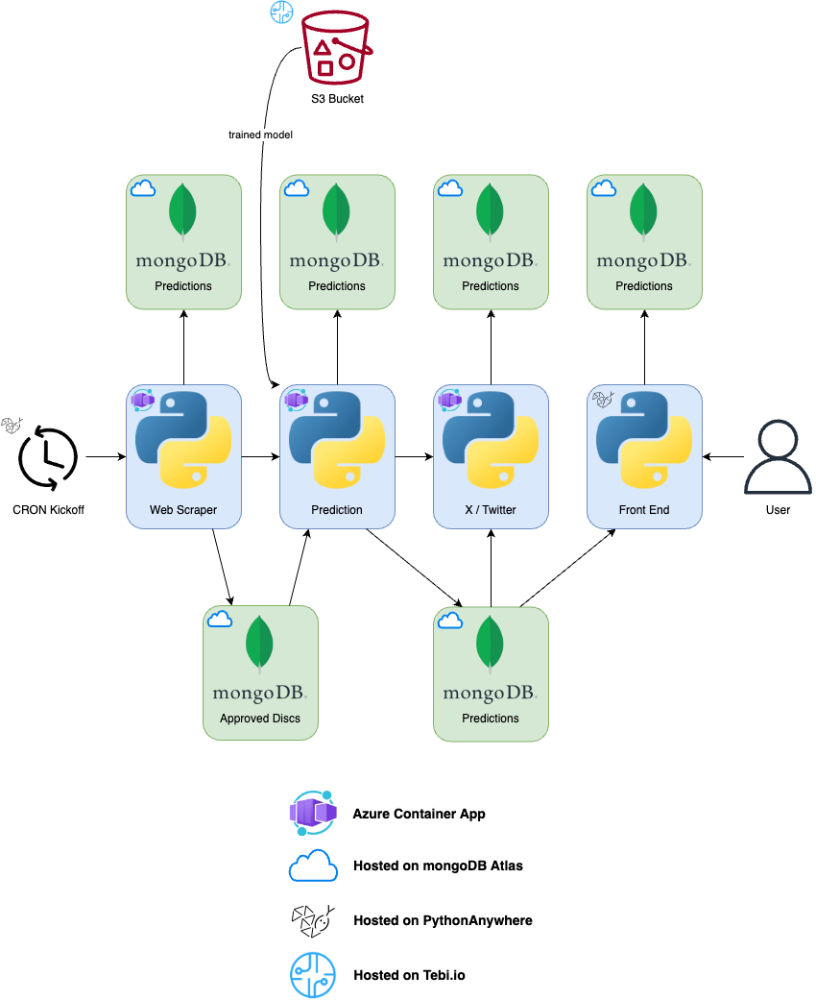

# PDGA Flight Forecast

Predicting the flight numbers of discs newly submitted to the PDGA for approval.

## Background

In disc golf, different discs have different flights:

These flights (or flight paths) are determined by the physical measurements of the discs. These often get summarized by "flight numbers":

Flight numbers are determined in by the manufacturer of the disc through two primary methods: 

1. How do people testing the disc feel that it flies compared to other discs they have thrown.
2. What the physical measurements of the disc suggests.

When a manufacturer makes a new disc they first must submit it to the PDGA for approval, as there are certain constraints a disc must fall within. The PDGA posts the newly approved discs [on their website](https://www.pdga.com/technical-standards/equipment-certification/discs). However, only the disc dimensions are posted, not its flight numbers, leaving many disc golfers anxiously speculating at what the newest discs might fly like.

The goal of this project is to scrape the PDGA website and use a machine leaning model ([developed here](https://github.com/straslerj/disc-golf-flight-numbers)) to predict the flight of the newly submitted discs.

## Overview

This project scrapes the PDGA site daily to check for newly approved discs. Upon finding newly approved discs, the discs' measurements are scraped from the PDGA website for a machine learning model to use to predict the flight numbers for the newly approved discs. New predictions get posted to [X (Twitter)](https://twitter.com/flight_forecast) and to [pdga.jakestrasler.com](https://pdga.jakestrasler.com).

## Architecture

This system deploys three Dockerized ReST services to Azure Container Apps. Another service, the front end, is deployed on PythonAnywhere and hosted using Cloudflare. These services read and/or write to mongoDB collections. The scraping service is kicked off daily by a CRON job with makes a call to the web scraper, which automatically kicks off the full system if new discs are added.

Services are automatically updated with the most recent push to `main` using a Github workflow that builds each Docker container and pushes it to Docker Hub.
